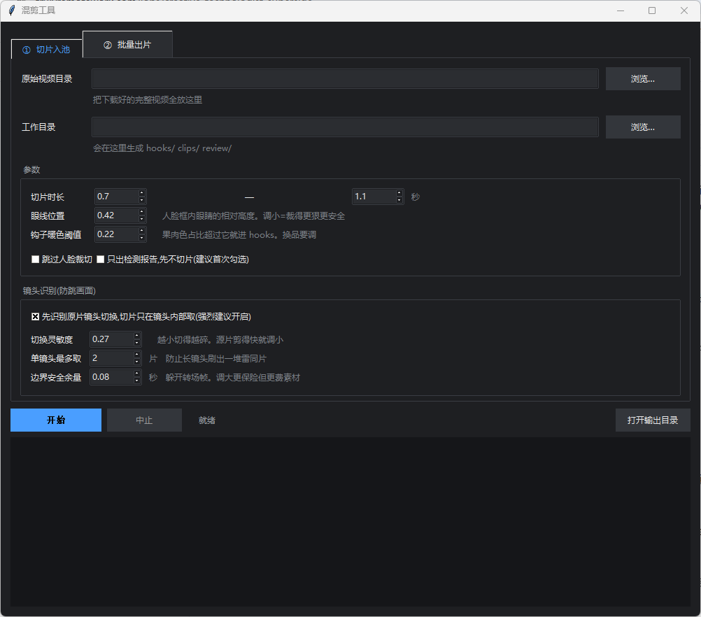
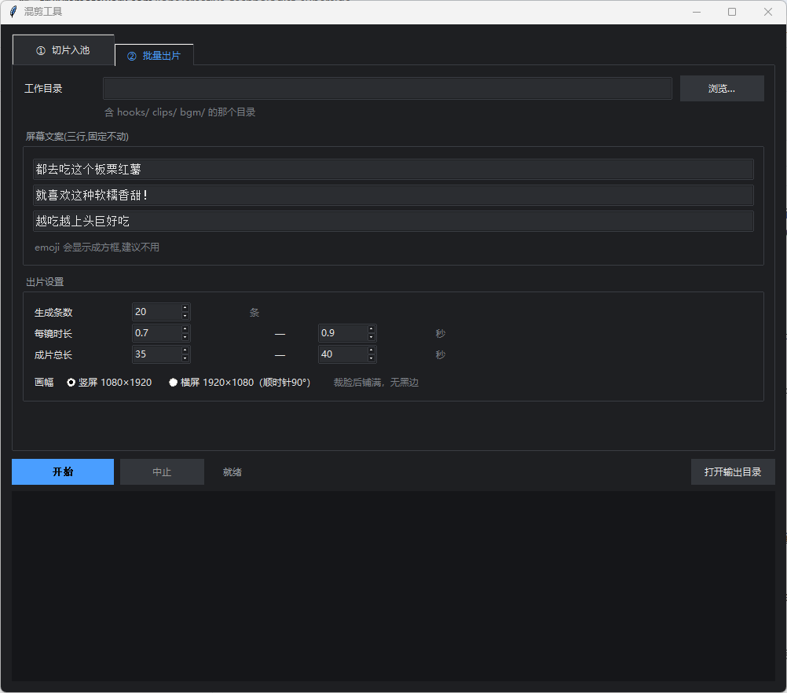

# 水果快切混剪工具 · Fruit FastCut

Windows 桌面视频混剪工具：原片切片、人脸检测裁切、横竖屏输出、固定三行文案和批量选镜。

## 软件界面

切片入池：



批量出片：



## 成片效果示例

板栗红薯成片，1080×1920 竖屏，约 39 秒。点击下方封面打开原视频：

[](docs/examples/sweet-potato-finished.mp4)

[打开成片视频（MP4，约 28 MB）](docs/examples/sweet-potato-finished.mp4)

示例由项目维护者提供，作为效果展示；不包含原始素材池。

## Windows 运行包

从 GitHub Releases 下载 `FruitFastCut-windows-x64.zip`，**完整解压**后打开 `FruitFastCut.exe`。无需安装 Python。请保留旁边的 `_internal` 文件夹。

运行前需要安装 FFmpeg，并让 `ffmpeg`、`ffprobe` 能在命令行运行。Windows 可使用 `winget install Gyan.FFmpeg`，安装后重新启动程序。程序运行包不包含 FFmpeg。

## 使用方法

1. 在“① 切片入池”选择原始视频目录和一个新的空工作目录，点击开始。
2. 检查生成的 `hooks/`（钩子）、`clips/`（常规）和 `review/`（待人工判断）。在 `bgm/` 放入音乐。
3. 在“② 批量出片”选择该工作目录，填写文案、条数、时长和画幅，然后开始。
4. 成片、封面和镜头清单保存在工作目录的 `out/`。

`hooks` 和 `clips` 都参与正文选镜，开头从 `hooks` 选。只有钩子素材时也可出片，但需要足够多的不同来源。

## 画面处理

- 竖屏 1080×1920；横屏 1920×1080，所有素材顺时针旋转 90°，文字保持正向。
- 无确认人脸的切片不裁边，不做随机放大；整幅适配输出尺寸。源比例不同会产生拉伸。
- 检出人脸后，仅用当前切片内相邻采样的确认结果裁去眼线上方，再等比铺满输出画幅，不补黑边。
- 使用 YuNet 模型，默认每秒采样 5 帧、置信度 0.9。检测并不保证零误检、零漏检，重要素材请查看报告并预览。
- 字号 36、行间隔 10，三行分别定位；长文案自动缩小。

## 选镜规则

- 单条不重复同一切片，同一原片两次出场间至少隔两个其他镜头。
- 同一批次优先使用较少出场的切片，计数仅在当前批次有效。
- 素材不足时明确报错，不循环复用凑时长。
- 根据切片路径和原片来源去重，尚不包含跨原片的视觉相似度检测。
- `manifest.json` 的 `timeline` 记录切片路径、原片来源、起点和时长。

## 从源码运行

推荐 Python 3.12（含 Tkinter），并安装 FFmpeg。

```powershell
python -m venv .venv
.\.venv\Scripts\python -m pip install -r requirements.txt
.\.venv\Scripts\python launcher.py
```

命令行方式：

```powershell
python prep_clips.py --src "原片目录" --out "新工作目录"
python batch_cut.py --dir "工作目录" --n 20 --config "config.json"
python -m unittest discover -s tests
```

配置 JSON 可覆盖 `prep_clips.py` 中的 `CFG` 或 `batch_cut.py` 中的 `CONFIG`。原素材池已裁掉的内容无法恢复；旧版素材池需要从原片重新构建。程序不上传视频、图片或音乐到网络。

## 构建 Windows 包

在 Windows、Python 3.12 环境运行 `build_windows.ps1`。产物位于 `dist/FruitFastCut/`，压缩包位于 `dist/`。FFmpeg 单独安装，不随包分发。

第三方模型来源与许可证见 `THIRD_PARTY_NOTICES.md` 和 `licenses/`。本仓库仅包含明确选定的展示成片，不包含原始素材池、单独音乐文件或本地验证输出。
