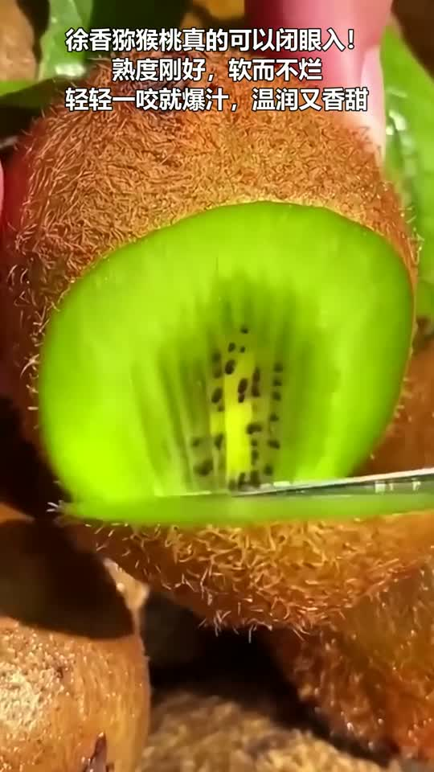
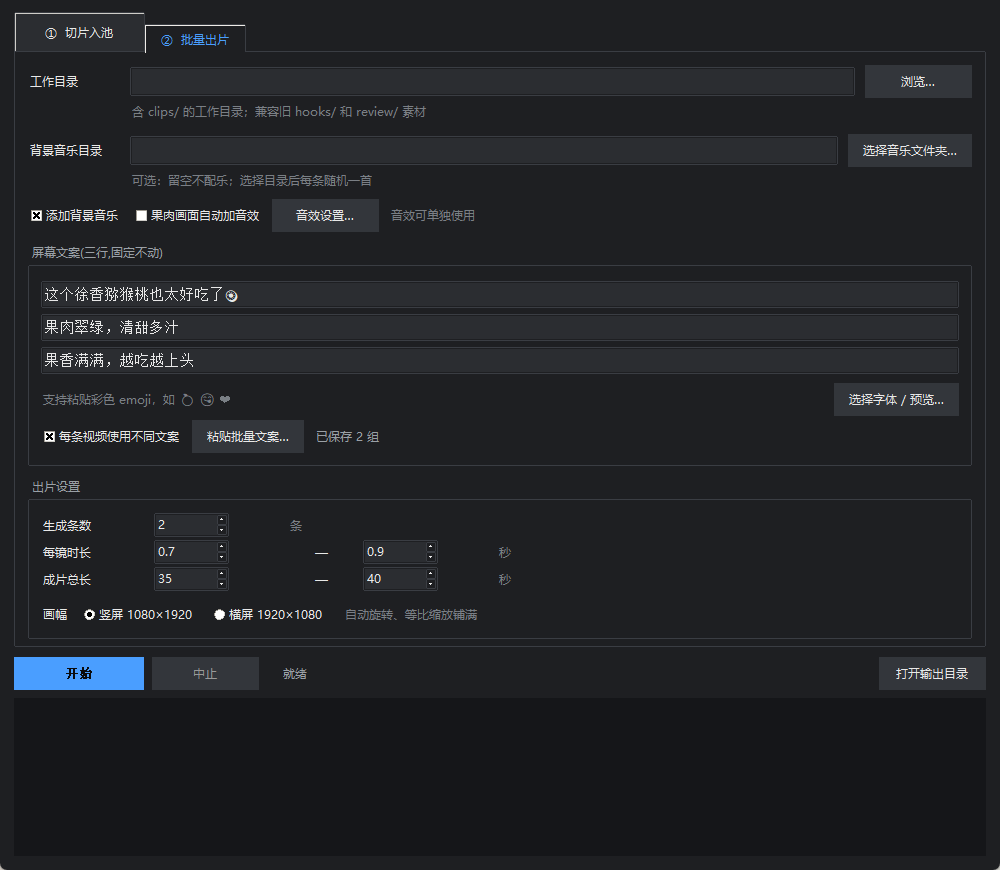
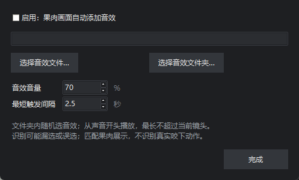
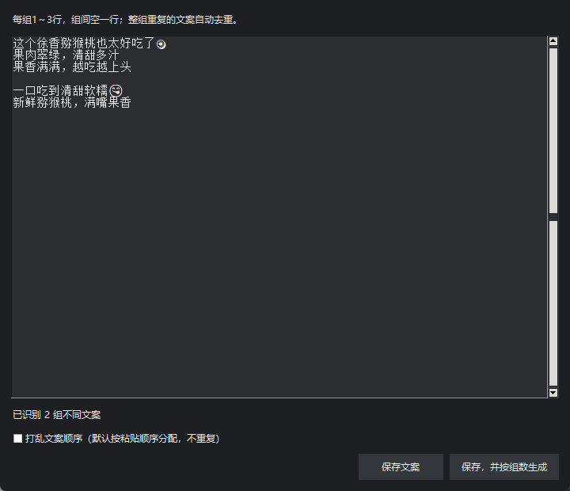
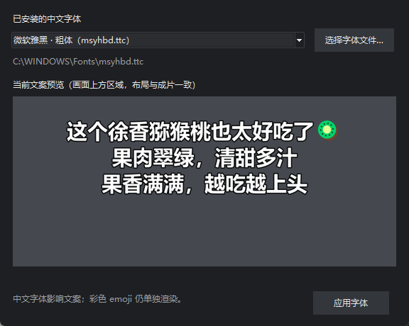

# 水果快切混剪工具 · Fruit FastCut

Windows 桌面工具：原片切片、人脸检测裁切、横竖屏适配、批量混剪、文案与声音合成。

## 最新版 v1.2.1

取消出片时的首帧封面导出，不再生成 `_cover.jpg`；保留视频和 `manifest.json` 镜头清单。

### v1.2.0 已有功能

| 新功能 | 使用方式 |
|---|---|
| 果肉画面自动音效 | 本地 SigLIP Base 识别露出果肉的镜头，自动添加自己选择的吃水果音效；支持音量、触发间隔与识别缓存 |
| 背景音乐可选 | 选择音乐目录随机配乐；目录留空或取消勾选即可不配乐，音效仍能单独使用 |
| 每条视频不同文案 | 一次粘贴多组文案，顺序或随机分配，去重且不自动重复，可按文案组数设置生成条数 |
| 字体选择与预览 | 选择系统中文字体或 TTF/OTF/TTC 文件，预览后应用；彩色 emoji 继续正常渲染 |

[下载 Windows 运行包与源码](https://github.com/littlexx15/fruit-fastcut/releases/tag/v1.2.1)

## 成片效果示例

### 新案例：徐香猕猴桃

维护者提供的实际成片，1080×1920，约23秒。网页播放器无需下载，保留声音与完整时长。

**[▶ 在线播放猕猴桃成片](https://littlexx15.github.io/fruit-fastcut/)**

[](https://littlexx15.github.io/fruit-fastcut/)

[原始清晰版](docs/examples/kiwi-finished.mp4)

### 云南爱媛果冻橙

约37秒，在线播放版540×960：

https://github.com/user-attachments/assets/8a85750a-00ba-43a7-8fdd-a5cf7400357c

[原始清晰版](docs/examples/orange-finished.mp4)

### 板栗红薯

约39秒，在线播放版540×960：

https://github.com/user-attachments/assets/6b04cb87-c370-4231-a442-0880abd5b886

[原始清晰版](docs/examples/sweet-potato-finished.mp4)

## 软件界面



| 音效设置 | 批量文案 |
|---|---|
|  |  |



## 安装和使用

1. 在 Releases 下载 `FruitFastCut-windows-x64.zip`，完整解压后运行 `FruitFastCut.exe`，无需安装 Python。
2. 保留旁边的 `_internal`、`models` 文件夹；Windows 包已附带离线果肉识别模型。
3. 单独安装 FFmpeg，让 `ffmpeg`、`ffprobe` 可从命令行运行。例如使用 `winget install Gyan.FFmpeg`，安装后重启软件。运行包不附带 FFmpeg。
4. 选择原始视频目录，工作目录自动填写为“原目录名-切片”。切片成功后自动同步至批量出片页。
5. 按需设置背景音乐、果肉音效、文案、字体、条数、时长与画幅，点击开始。成片和清单保存在工作目录 `out/`，不生成封面图片。

## 果肉画面自动音效

勾选「果肉画面自动加音效」，在「音效设置…」选择自己的音效文件或文件夹。文件夹内随机选取，从声音开头播放，不循环；超过当前镜头的部分截断并淡出。默认音量70%、最短触发间隔2.5秒。音效文件需自行准备。

使用旧版 Google SigLIP Base，检查实际选用区间内的采样帧，按输出画幅适配后识别。仅识别果肉展示，**不识别真实咬下动作，可能漏选或误选**。关闭音效时不加载模型。

识别结果缓存到工作目录 `_flesh_cache.json`，按文件、修改时间、采样位置、画面适配和模型版本区分；重复出片复用缓存。CPU本地运行，不调用在线API。模型是原始 SigLIP 的 FP32 图像编码器（约372 MB）和固定文字向量，仅转换推理格式，未经重新训练。

## 可选背景音乐

音乐目录留空或取消「添加背景音乐」即可不配乐；果肉音效可单独使用。两者都关闭时输出静音，原素材声音仍不保留。

配乐支持 MP3、M4A、WAV、AAC、FLAC。每条随机一首，一轮用完全部歌曲后再随机；音乐从0秒播放，短音乐循环到片尾。启用配乐并指定了无有效音乐的目录时，会提示检查。

## 批量文案和字体

点击「粘贴批量文案…」，**每组1～3行，组间空一行**。例如：

```text
清甜多汁的徐香猕猴桃🥝
软糯细腻，满嘴果香

这一口猕猴桃真好吃😋
果肉翠绿，清甜多汁
```

相同文案组自动去重；默认按顺序，可选择打乱顺序。点击「保存，并按组数生成」，100组文案就设置生成100条；文案不足时提示补充，不自动复用。取消「每条视频使用不同文案」恢复固定文案。

点击「选择字体 / 预览…」选择已安装中文字体或导入 TTF、OTF、TTC 文件，点击「应用字体」。批量模式预览第一组。中文字体与彩色emoji分别渲染；emoji使用系统 Segoe UI Emoji。默认字号58，长文案自动缩小。

## 画面与选镜

- 竖屏1080×1920，横屏1920×1080。横竖方向不一致时旋转90°，然后等比例缩放铺满，裁掉溢出部分；不会单向拉伸。
- 多帧确认稳定黑边后去除；手机旋转元数据与人脸裁切前的方向参与画幅处理。
- 人脸由 YuNet 检测，局部确认后裁切；存在误检、漏检可能，请预览重要成片。
- 全部切片统一参与选镜，兼容旧 `hooks/`、`clips/`、`review/`。整批优先使用未用切片，一轮用完再随机，尽量错开同源相邻镜头。
- 轮次按文件路径统计，不做跨文件视觉去重；不同文件的画面相同仍可能产生重复感。
- `manifest.json` 记录镜头时间线、实际文案、字体、背景音乐、果肉识别和音效位置。

## 从源码运行与构建

推荐 Python 3.12（含 Tkinter），另外安装 FFmpeg：

```powershell
python -m venv .venv
.\.venv\Scripts\python -m pip install -r requirements.txt
.\.venv\Scripts\python launcher.py
```

若需果肉音效，将 Windows 运行包里的 `models` 文件夹复制到源码目录。模型不存入 Git 历史，仅随运行包分发；其余功能不依赖该文件夹。

```powershell
python prep_clips.py --src "原片目录" --out "新工作目录"
python batch_cut.py --dir "工作目录" --n 20 --config "config.json"
python batch_cut.py --dir "工作目录" --n 20 --no-bgm
python -m unittest discover -s tests
```

`build_windows.ps1` 构建 `dist/FruitFastCut/` 和对应ZIP；若源码旁有模型文件夹会一并打包。完整许可证见 `THIRD_PARTY_NOTICES.md` 和 `licenses/`。

本仓库只包含维护者明确选定的展示成片，不包含原始素材池、独立音乐/音效或本地验证输出。软件处理素材时不上传视频、图片或音乐到网络。
